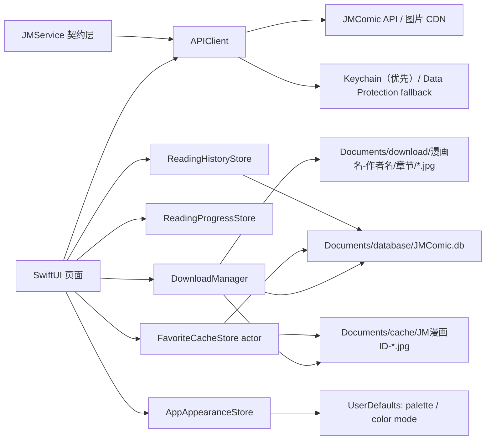
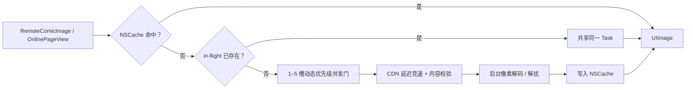
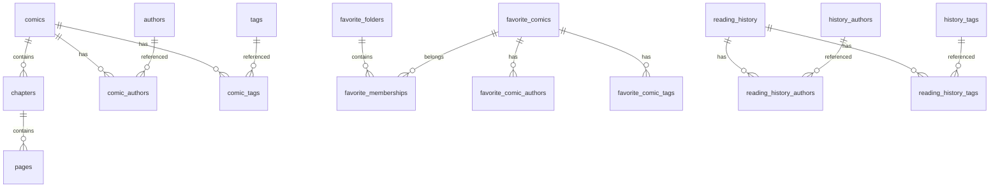
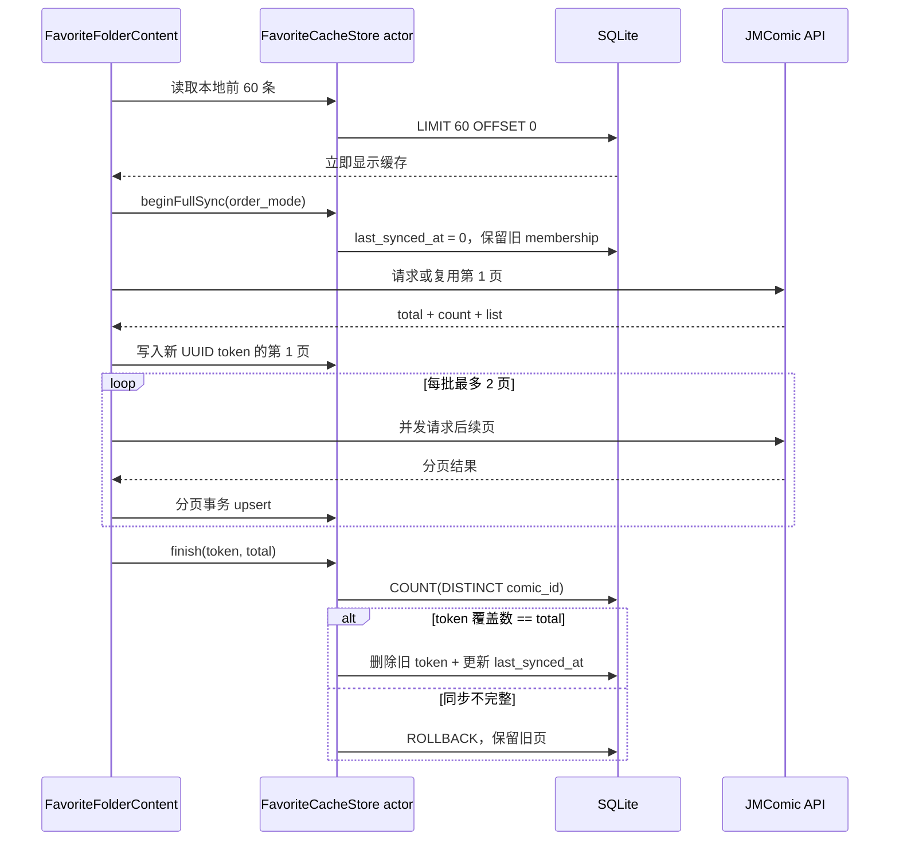
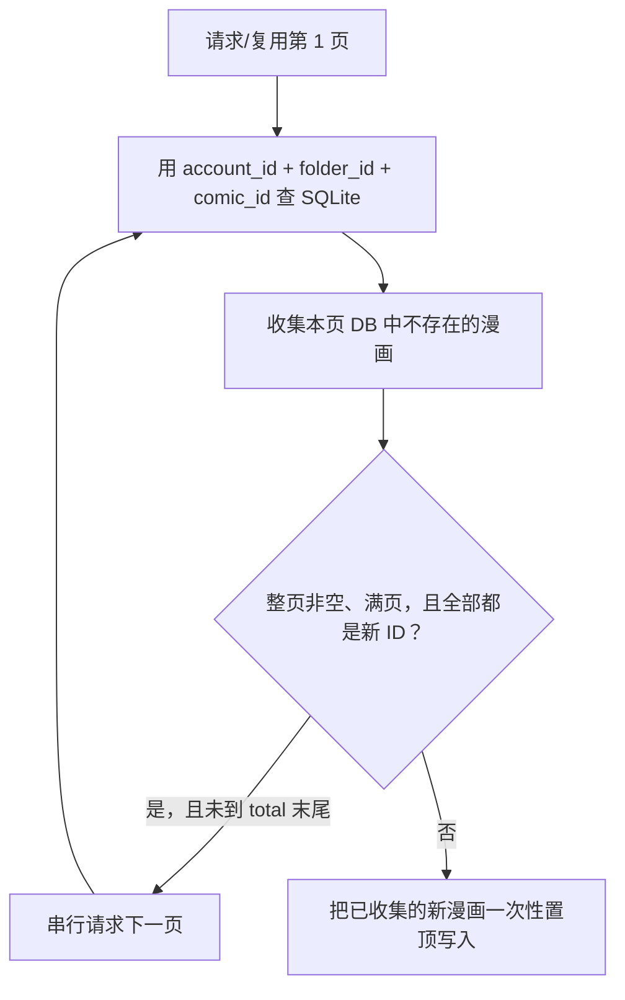

# JMComic iOS / iPadOS 实现说明

## 1. 文档范围

本文档说明当前 SwiftUI 客户端的整体架构、JMComic 协议适配、登录会话、收藏夹数据库、下载传输、图片解扰、阅读器、最近观看、外观设置、iPhone/iPad 适配以及 IPA 构建签名方式。

项目参考 `tonquer/JMComic-qt` 和 `jmcomic 2.6.20` 中的协议行为，客户端代码使用 Swift/SwiftUI 独立实现。第三方项目声明见 `THIRD_PARTY_NOTICES.md`。

### 当前构建信息

| 项目 | 值 |
|---|---|
| App 版本 | `1.0.0 (20)` |
| Bundle ID | `io.github.jmcomic.mobile` |
| 最低系统 | iOS / iPadOS 18.0 |
| 构建 SDK | iOS / iPadOS 26.5 |
| 设备族 | iPhone + iPad (`1,2`) |
| 主程序架构 | arm64 |
| 本地数据库 | SQLite3 + WAL |
| 第三方运行时依赖 | 无，仅链接系统 `libsqlite3.tbd` |

## 2. 总体架构

App 采用 SwiftUI + ObservableObject 状态管理。入口 `JMComicApp` 创建并注入五个全局环境对象：

- `JMService`：上游地址、endpoint/字段/编码、签名常量、媒体路径和响应 schema 的独立契约层。
- `APIClient`：请求调度、故障转移、Cookie、响应解密与图片传输，不再定义业务协议字面量。
- `DownloadManager.shared`：普通 `URLSessionDataTask`、双层并发限制、解扰落盘和离线书库迁移。
- `ReadingProgressStore`：少量阅读位置。
- `ReadingHistoryStore`：同一可见 SQLite 中的本地最近观看、分页和清空。
- `AppAppearanceStore`：6 种页面底色和系统/浅色/深色显示模式。



build 18 只保留普通 `URLSessionDataTask`。工程中没有后台传输会话、任务恢复回调或传输模式开关；下载字节在 App 进程内接收，校验、解扰后再写入 Files 可见目录。这条路径避免了侧载环境中系统传输守护进程无法创建临时文件的问题。

## 3. 目录与职责

| 路径 | 主要职责 |
|---|---|
| `JMComic/App/` | App 入口、启动会话/签到流程、五个环境对象注入 |
| `JMComic/JMService/` | 内置地址、请求契约、签名常量、媒体路径和响应字段的唯一来源 |
| `JMComic/Core/` | 数据模型、域名配置、Keychain、外观色板和显示模式 |
| `JMComic/Networking/` | API 请求、MD5 签名、AES 解密、图片解扰 |
| `JMComic/Services/` | 下载、离线/收藏 SQLite、阅读历史 SQLite、阅读进度 |
| `JMComic/Components/` | 封面、网格、远程图片和错误重试组件 |
| `JMComic/Features/` | 发现、搜索、详情、收藏、下载、阅读、评论、账号界面 |
| `JMComic/Resources/` | App Icon、颜色和 Privacy Manifest |
| `JMComicTests/` | 协议、解扰、数据迁移和 SQLite 测试 |

## 4. 网络协议

### 4.0 独立的 JMService 契约层

上游协议已从界面、`APIClient`、下载器和业务模型中拆出，集中到 `JMComic/JMService/`：

- `JMServiceAddresses.swift`：加密线路发现地址、`config.txt` 镜像、内置 API/CDN、默认 `HeaderVer` 和图片线路 1–4。
- `JMServiceProtocol.swift`：所有 endpoint、查询/表单字段、固定值、GET/POST/multipart 编码、普通/内容签名范围、Cookie/Header、签名与解密常量、章节模板解析规则、图片分块代际和媒体路径。`JMServiceRequestSpec` 是纯值，因此可对每个请求的 method/path/query/form/encoding/signature 做 exact snapshot。
- `JMServiceResponseSchema.swift`：漫画、章节、账号、收藏、评论和签到响应的 JSON 字段表。

`AppConfiguration` 只保存运行时可变状态（当前线路顺序、动态发现结果和图片线路选择）。它持久化 `contractRevision`；应用内置契约升级时，旧安装保留用户当前首选线路，并幂等追加新的内置 fallback，不会因 UserDefaults 中的旧数据永久错过新线路。

当前 App 不打开 JM 网页、没有 WebView，因此不存在另一个需要维护的“网站首页地址”；现有网络地址只有 API、图片 CDN 与线路发现端点，已全部在 `JMServiceAddresses.swift` 中。若未来加入网页功能，网站 URL 也应只在该文件新增。

### 4.1 请求签名

`JMCrypto.signedHeaders` 使用 Unix 秒级时间戳。普通 API 的签名规则为：

```text
tokenparam = <timestamp>,<appVersion>
token      = MD5(<timestamp> + "18comicAPP")
version    = v1.3.3
```

请求 `/chapter_view_template` 时改用内容签名：

```text
token = MD5(<timestamp> + "18comicAPPContent")
```

GET 查询参数与 POST 表单字段都先按 key 排序。POST 内容类型为 `application/x-www-form-urlencoded`。

### 4.2 API 响应解密

服务端外层 JSON 先校验 `code == 200`。`data` 通常是 Base64 密文，解密流程为：

```text
Base64 解码
→ AES-ECB + PKCS#7 解密
→ AES key = MD5(timestamp + "185Hcomic3PAPP7R") 的 32 字节十六进制文本
→ 解密结果再解析为 JSON
```

MD5 由 CryptoKit 完成，AES 由 CommonCrypto `CCCrypt` 完成。网络 API 使用 JSON 是服务端协议要求，与本地高容量索引的存储方式无关。

### 4.3 域名动态更新与故障转移

`JMServiceAddresses` 内置多个 API 域名、图片 CDN 和图片线路 1–4；`AppConfiguration` 只持有当前顺序与 `imageShunt = 1` 选择。冷启动先刷新线路并建立 `/setting` 基础会话，但不可让失效镜像的系统默认长超时卡住整个 App。`refreshDomains()` 因此使用独立的 ephemeral 发现会话：

- request timeout 为 3 秒，resource timeout 为 4 秒，`waitsForConnectivity = false`。
- 加密上游域名列表与 `config.txt` 镜像组并发请求。
- `app.jpacg.cc`、`app2.jpacg.cc` 和 `app3.jpacg.cc` 三个配置镜像同时开始，第一个包含 `Url2List` 或 `PicUrlList` 的有效响应获胜，其余任务取消。
- 上一次已成功的 API/CDN 在新列表中仍被保持为优先项，不会因每次启动又回到已知较慢的线路。

发现结果会解密加密上游中的 API 域名，并解析 `config.txt` 中的 `Url2List`、`PicUrlList` 和 `HeaderVer`。域名列表一旦更新，便立即把已恢复的 `AVS` 克隆到当前所有 API host 并重新持久化；启动流程会在第一个认证请求前执行这一步，即使 `/setting` 暂时失败，也不会因 Cookie 仍只绑定昨日域名而误判未登录。只要安全存储中存在用户名/密码，每次新建 App 进程都会固定执行一次 `POST /login` 换取新 AVS，从而避免旧 Cookie 到第二天仍能通过部分接口、却在收藏接口返回 401 的不一致状态。线路超时、500 或解析错误不会清除已恢复的 Profile/Cookie；只有 401/403 或明确账号/密码/认证失败消息才判定旧会话不可继续保留。没有已保存密码的旧版会话仍使用未过期 AVS + `/daily` 验证。

每个普通 API 的单域名 attempt 最多等待 8 秒，失败后才按配置顺序尝试下一域名；一旦成功便把该域名移到队首。`requestRaw` 会单独记住任一备选 API 的明确 401/403；即使之后的域名只返回 timeout，最终仍优先抛出认证失效，从而既不漏掉必要重登，也不会因纯超时重登。任务取消（`CancellationError` 或 `NSURLErrorCancelled/-999`）会立即终止故障转移，不会在页面离开后继续轮询所有域名。图片 CDN 的竞速和校验见 7.4。封面 `_3x4.jpg` 全部失败时会回退到普通 `.jpg`。

“我的 → 设置 → 线路”不再只显示不可选文字：

- **API 接口**：`Picker` 列出当前 `apiDomains`，选中项持久化并移到故障转移队首。
- **图片线路**：可选线路 1–4，持久化为 `imageShunt`；请求 `/chapter_view_template` 时作为 `app_img_shunt` 发送。返回 HTML 中的 `imghost` 会被解析并提到图片备选队首，因此选择会真正同时影响在线阅读和下载。
- 旧版 `jm.configuration` 没有 `imageShunt` 时默认为线路 1，读取和设置时均夹到 1…4。
- 保留“添加自定义域名”、“从上游更新线路”和“恢复内置线路”。手动改 API、上游更新和恢复内置后都会立即重新 clone/persist AVS；恢复内置还会清除由上一图片线路临时记忆的 `preferredImageDomain`，并将图片线路回到 1。

### 4.4 API 功能映射

| 功能 | Endpoint |
|---|---|
| 首页推荐 | `GET /promote?page=` |
| 最近更新 | `GET /latest?page=` |
| 搜索 | `GET /search?search_query=&page=&o=` |
| 漫画详情 | `GET /album?id=&comicName=` |
| 章节数据 | `GET /chapter?id=&comicName=&skip=` |
| 解扰参数 | `GET /chapter_view_template?...` |
| 登录 | `POST /login` |
| 收藏列表 | `GET /favorite?page=&folder_id=&o=` |
| 收藏/取消 | `POST /favorite`，字段 `aid` |
| 新建收藏夹 | `POST /favorite_folder`，`type=add` |
| 删除收藏夹 | `POST /favorite_folder`，`type=del` |
| 移动收藏 | `POST /favorite_folder`，`type=move` |
| 评论列表 | `GET /forum?mode=manhua&aid=&page=` |
| 我的评论 | `GET /forum?mode=undefined&uid=&page=` |
| 发评论/回复 | `POST /comment`，multipart 字段 `comment`、`aid`、`status=1`、可选 `comment_id` |
| 每日签到状态 | `GET /daily?user_id=` |
| 提交每日签到 | `POST /daily_chk`，字段 `user_id`、`daily_id` |

## 5. 登录与会话

### 5.1 首次登录和安全持久化

1. 用户提交用户名和密码，客户端请求 `/login`。
2. 响应解析 `uid`、用户名、等级、JCoin、收藏数量/限制、`photo`、`exp` 和 `nextLevelExp`。
3. 如果响应含 `s`，对每个 API 域名创建 `AVS` Cookie，并将非 Cloudflare 会话 Cookie 复制到备用域名。
4. 登录成功后，用户名/密码、Cookie 记录和用户资料分别写入 Keychain-first 安全存储；只在 Security.framework 明确不可用时使用下述受保护 fallback。

Keychain 条目使用 `kSecAttrAccessibleAfterFirstUnlockThisDeviceOnly`：只在设备首次解锁后可用，且不会随备份迁移到另一台设备。保存先执行 `SecItemUpdate`，仅在 `errSecItemNotFound` 时再 `SecItemAdd`，避免为更新已存在项目先删后建留下空窗。

部分 unsigned 模拟器或侧载安装没有 Keychain access group entitlement，Security.framework 会在登录 API 已成功后返回 `errSecMissingEntitlement (-34018)`。`KeychainStore` 因此有一个只针对“钥匙串不可用”状态的受保护回退：

- `-34018`、`errSecNotAvailable` 或 `errSecUnimplemented` 时，将小型凭证/Cookie/Profile 数据原子写入 `Library/Application Support/JMComicSecureState`。
- 文件使用 `completeUntilFirstUserAuthentication` iOS Data Protection，账户标签不出现在路径中；文件名是 service + account 的 SHA-256 不透明查找键。目录不在 Documents，不会出现在 Files 的 JMComic 文件夹中。
- 只有明确的不可用状态才回退；`errSecAuthFailed` 等其他安全错误仍向上抛出，不会被静默吞掉。
- 日后带正确 entitlement 的签名版能成功保存 Keychain 时，会删除对应 fallback 副本；退出登录始终同时删除两个存储点，防止签名能力变化后旧会话残留。

登录密码不写入 UserDefaults、SQLite 或 Documents 中的普通文件。Keychain/受保护 fallback 内的少量登录数据使用 Codable 序列化；这与收藏/下载的高容量 SQLite 索引无关。

### 5.2 每个 App 进程启动时刷新一次登录凭证

`JMComicApp` 在每次新建 App 进程时调用 `APIClient.bootstrap()`。启动流程是：

```text
恢复 Keychain（或受保护 fallback）中的资料/Cookie
→ 刷新 API 和图片域名
→ 请求 /setting 建立基础会话并跨域复制 Cookie
→ 若存在已保存的用户名/密码，固定 POST /login 一次
→ 更新 Profile、AVS、备用域名 Cookie
→ GET /daily 取得本进程共享的启动签到快照
```

- `bootstrapTask` 将同一次冷启动的并发调用合并为一个任务，`hasCompletedBootstrap` 保证每个 App 进程只执行一轮，因此收藏页、搜索页和“我的”同时出现也只会发出一次启动登录。
- 普通 API 和图片请求在启动任务完成前会等待，避免收藏同步与会话恢复并发使用旧 Cookie。等待后才生成请求时间戳，避免签名过期。
- 启动登录失败时，`isExplicitAuthenticationFailure` 只把 401/403、密码错误、账号或会话失效等明确结果视为认证失败；短暂网络错误保留原 Profile/Cookie 并显示可重试警告，不会因临时断网把用户退出。
- 从不保存密码的旧版升级可能只有 Profile/Cookie。此时 `hasUsableAuthenticationCookie` 只把非空且未过期的 `AVS` 当作可验证会话，使用 `/daily` 验证；若连 AVS 都不存在则清除误导性的旧登录状态，并提示重新登录一次。
- 每次认证都带有内存 generation。退出登录会先推进 generation 并取消仍在执行的启动任务；旧 `/login` 或 `/daily` 响应即使晚到，也无法重新写回 Profile、Cookie、签到快照或 Keychain。
- “我的 → 设置 → 账号 → 重新登录刷新凭证”是用户强制 POST `/login` 的入口，成功后同时强制刷新签到快照。

用户主动退时，客户端会删除系统 Cookie，并同时清除 Keychain 和受保护 fallback 中的用户名/密码、Cookie 与用户资料。

### 5.3 手动与自动签到

`DailyStatus` 解析 `/daily` 的 `daily_id`、活动名称、进度、3/7 天奖励及嵌套 `record` 日历，并保存响应取得时的年/月。月份计算固定使用 Gregorian 公历并继承设备时区，不受佛历、日本历等系统日历设置影响。记录优先使用服务端显式 `date` 日号；兼容端缺少或返回无效日期时，才按扁平数组位置回退到 1…N，并按该月真实天数过滤。今日判断同时比较年、月和日，App 跨月常驻时不会把上月同日误认成今天。个人页读取状态后提供手动“签到”与“刷新签到状态”；只有未签到且 `daily_id > 0` 才会提交 `POST /daily_chk`，成功后再读取一次状态。

签到卡标题进入 `DailyCheckInDetailView`。二级页固定展示当前共享快照对应的月份，因为 `/daily` 没有月份参数，不能伪造历史月份切换：

- 7 列周日优先月历按真实首日星期和闰年月天数排版；已签到在左上显示勾，额外奖励日在右下显示星标，今天使用当前主题强调色。
- 月累计与最长连续天数分开计算；最长连续段严格按日号排序，未签、缺日或日期跳跃都会中断。
- 1–7 天进度、3/7 天金币和经验奖励都来自同一份 `/daily` 快照，不读取 Android 客户端背景图，也不破坏本 App 的六套主题和深浅模式。
- 页面使用 `AppLoadingView`、`RetryView`、`regularMaterial + 20pt continuous corner`、系统下拉刷新及导航栏 spinner，与详情/评论/个人页视觉一致。

自动签到使用 UserDefaults 键 `jm.account.automatic-daily-check-in`，默认为 `false`：

```text
冷启动 bootstrap（线路 + /setting + 每进程一次登录刷新）完成
→ 复用 bootstrap 已取得的 /daily 快照
→ 今日未签到时才 POST /daily_chk
```

- `DailyStatusRefreshPolicy` 为每个账号记录“本进程已尝试”。即使启动的 `/daily` 失败，每次重进“我的”也不会再发请求。
- 个人页和签到二级页都只读发布的共享快照；进入页面没有 `.task/onAppear` 网络请求。只有用户下拉或点“刷新签到状态”、切换到新账号、手动刷新凭证，或签到成功后核对结果才会再 GET `/daily`。
- `/daily` 本身也是按账号和认证 generation 的 single-flight：下拉、工具栏或启动请求相遇时复用同一任务；operation ID 保证旧响应不能覆盖新账号，也只有当前请求能结束 loading。重新认证、退出和账号切换会取消旧请求并立即复位 loading，不会留下永久转圈。
- 手动登录成功后，首个签到快照和可选自动签到在独立 `Task` 中执行；登录页立即关闭。
- 已签到时不会重复 POST。跨月常驻时先强制刷新 `/daily`，不会拿上月 `daily_id` 提交。`APIClient` 持有全局签到任务和发布的 `isSigningDailyCheckIn`，一级卡片与二级页同时触发时复用同一任务；跨月刷新产生的 suspension 之后还会复查任务，右滑返回或两个并发调用都不能再次提交。POST 前先等待已有状态 GET，POST 成功后取消任何更早发起的状态请求、乐观标记今天已签，再用一条确定在提交后新建的 GET 校正，因此旧快照或核对失败都不会重新启用重复签到。退出、换号和重新认证会取消旧任务，认证 generation 继续阻止旧响应回写。失败只写入 `dailyCheckInError` 并在两个页面显示，不会撤销已成功的登录或阻塞其他页面。
- 自动签到开关、凭证刷新和退出登录都放在设置二级页，个人一级页只保留资料、我的评论入口、签到卡片和最近浏览。

## 6. 发现、搜索与详情

### 发现

`ExploreViewModel` 并发请求 `/latest` 和 `/promote`，再组合成稳定栏目：固定保留“最新更新”（即使当前结果为空），其余保留服务端返回的每个标题，包括“连载更新”、“右滑看更多”或 C107/推荐等动态栏目。

页面顶部是明确的点按式 `Menu`：只渲染当前选中的一个 `ComicGrid`，不再把全部栏目纵向混排。栏目不使用 page-style `TabView`、水平 `ScrollView` 或任何滑动手势，左右滑动专用于根页切换。栏目 ID 使用“标题 + 同名序号”，刷新时先按 ID、再按标题恢复选中项。

首次载入只由 `ExploreView` 在页面中心显示一个无文字的 glass/material `ProgressView`。`RootView` 不再叠加顶部 bootstrap spinner，因此不会出现截图中上下两个载入图标。

### 搜索

支持漫画名、作者、标签、JM 号与四种排序：

- `mr`：最新。
- `mv`：最多点击。
- `mp`：最多图片。
- `tf`：最多收藏。

搜索结果为空且输入中有有效数字时，会将数字当作 JM ID 请求详情。

`SearchView(initialQuery:)` 会先去掉首尾空白，把关键词填入系统搜索框，并在页面首次出现时自动搜索。详情页的作者、标签 `tags`、作品 `works` 和角色 `actors` 都是这种导航链接；点击“全彩”、“巨乳”或作者名时，会真正搜索对应原始关键词，而不是只改变页面标题。搜索首屏等待同样只显示 spinner。

搜索框为空时会在主题背景上显示与其他页面一致的 `regularMaterial + 20pt continuous corner` 历史卡片。只有用户提交搜索、点选历史或从作者/标签进入的预填搜索才记录；错误重试和切换排序不会伪造新历史。`search_history` 对多空白、大小写和全/半角做规范化键去重，保留用户最后输入的展示文字；写事务中裁到 50 条，界面读取最近 20 条。删除使用明确的 `xmark` 按钮，不使用会与根标签左右切换冲突的 row swipe action。

### 漫画详情

展示封面、名称、可点击作者、浏览数、点赞数、评论数、简介、标签、作品、角色和章节。服务端未返回 `series` 时，使用漫画 ID 创建单章节 fallback。详情页是收藏、下载、评论和阅读的统一入口。收藏模块的详情列持有独立 `NavigationStack`：从某个收藏夹内容进入漫画详情后，系统返回动作只弹出漫画详情，仍停留在原收藏夹内容，而不是把折叠后的 `NavigationSplitView` 整体退回收藏夹根页面。

`ComicDetail` 同时解析 `/album` 返回的 `related_list`。推荐项兼容字符串或数组形式的作者，会过滤空 ID、当前漫画和重复 ID，再在详情底部以横向封面卡片展示“相关推荐”。点击推荐会继续进入对应 `ComicDetailView`。详情数据未到达前只有居中大号 spinner 和无障碍标签，不再出现“载入漫画详情…”方块。评论列表和其他主要首屏载入状态也统一为纯 spinner。

封面、头像和阅读页都经过 `APIClient` 的共享图片管线，不再由每个 SwiftUI View 各自下载。具体缓存上限和请求合并策略见 7.4。

## 7. 图片解扰和阅读器

### 7.1 `scramble_id`

获取章节时并发请求：

- `/chapter`：返回章节和图片文件列表。
- `/chapter_view_template`：返回 HTML，正则提取 `var scramble_id = <number>`。

无法提取时使用兼容默认值 `220980`。

### 7.2 切片数量

`ImageScrambler.segmentationCount` 实现：

- `photoID < scrambleID`：不解扰。
- `photoID < 268850`：固定 10 段。
- `photoID <= 421926`：`(MD5(photoID + filename) 最后字节 % 10) * 2 + 2`。
- 更大的 ID：上式模数改为 8。

参与 MD5 计算的文件名会先移除扩展名。

### 7.3 图片还原和直接像素解码

1. `CGImageSource` 使用 `kCGImageSourceShouldCacheImmediately` 在后台任务中立即解码像素，而不是把昂贵的惰性解码留到 SwiftUI 首次绘制。
2. 源 `CGImage` 一次绘入原尺寸、32 位 RGBX bitmap；不施加 UIKit 纵向翻转、缩放、插值或抗锯齿。
3. 使用一行 scratch buffer 就地反转全部扫描线，再反转每个分块内的行，等价于倒置分块顺序但完整保留块内行序。第一个还原块单独吸收 `height % count` remainder，高度不可整除时也不丢行。
4. JM CDN 会先把错序条带拼成一张图，再用有损 VP8 WebP/JPEG 编码。色度上采样会把当时相邻、但在真实页面中无关的两个分块混合；倒序后这种污染便成为周期性横向彩线，并会被写进下载文件，因此不是 SwiftUI 或系统预览的渲染问题。
5. 对明确 JPEG 或明确有损 `VP8 ` WebP，每个还原分块边界取 `join-3` 和 `join+2` 两条未污染锚点，只重建中间四行的色度。插值 RGB 后同时向 R/G/B 加上原始 BT.601 亮度差，因而消除假色接缝而不抹掉线稿/文字亮度。条带过短时仍正常解扰，只跳过无安全锚点的可选修复。
6. PNG、GIF、BMP、TIFF、无损 VP8L WebP 和未知格式不进入接缝修复，保持无损像素；不会为了修彩色页而改动其他图片。
7. 在线阅读的 `decodeImage` 直接返回解扰且修复后的 `UIImage`，不经历“先编码 JPEG、马上又解码 JPEG”的 CPU 与内存峰值。
8. 下载路径调用同一像素修复，再以 0.96 质量编码为 JPEG 并原子写入 Documents；回归测试会再次解码这个 JPEG，验证二次有损编码不会恢复原横线。对不需要解扰的页保留服务端原数据。

build 15 之前已下载的 JPEG 已经固化了接缝，无法仅靠升级代码恢复丢失的色度。这些章节必须删除后重新下载。

像素解码和解扰都放在 `Task.detached`。阅读页使用 `.userInitiated` 优先级，封面和头像使用 `.utility`，避免把图片解码工作堆到主线程。

### 7.4 共享图片管线和 CDN 竞速



管线的具体边界：

- 封面/头像的 `remoteImageCache` 最多 180 张、约 96 MiB；解扰阅读页的 `decodedPageCache` 最多 28 张、约 224 MiB。成本使用 `bytesPerRow × height` 计算，不用压缩文件字节数低估实际像素内存。
- `remoteImageLoads[path]` 和 `decodedPageLoads[chapterID|scrambleID|filename]` 合并正在进行的同一张图请求。SwiftUI 因 `LazyVStack`/`TabView` 回收某个 View 而取消其等待时，共享任务仍可完成并入缓存，页面重现时不会从头下载。
- `AsyncPermitPool` 的有效上限每次从“缓存图片并发数”读取，范围 1…5、默认 4。它同时约束封面、头像和在线阅读页；阅读页 `.userInitiated` 等待者优先于封面 `.utility`，被取消的排队者会移出队列，不泄漏 permit。
- 首选 CDN 立即发起。只有 1.25 秒内没有有效图片时，才按 `1.25 秒 × 备用顺序` 错峰启动其他 CDN；第一个有效结果获胜并取消其余任务。成功 CDN 被记为下次首选，避免每页重复碰已知慢线路。
- 每个图片请求的 timeout 为 8 秒。响应即使是 HTTP 200，也会优先校验 JPEG、PNG、GIF、WebP、BMP、TIFF、AVIF 或 HEIC 文件头；其他格式只在 `Content-Type` 明确为 `image/*` 且数据不是常见 HTML/JSON 前缀时接受。HTML/JSON 拦截页不能赢得 CDN 竞速。
- `CancellationError`、`NSURLErrorCancelled/-999` 及其 underlying error 被统一识别为正常取消。View 不再把它渲染成 `cancelled` 错误占位；真实失败页和封面提供点击重试。
- 当前阅读页显示后预取后续 2 页，预取也复用同一并发门、in-flight 表和解扰缓存，不会建立第二套无限制队列。

### 7.5 阅读模式

- 连续模式：`ScrollView + LazyVStack`。
- 分页模式：`TabView` 的 page style。
- 单击页面显示/隐藏导航控件。
- `ReaderPresentationLink` 是在线章节和离线已完成章节的唯一用户入口。它不在多列详情栈里 push `ReaderView`，而是用 `fullScreenCover` 创建独立 `NavigationStack`，因此会覆盖 iPad 根 `TabView.sidebarAdaptable`、收藏夹列和详情列，图片能使用整个应用窗口。
- 统一入口对内部 label 和外层 `Button` 都设置 `frame(maxWidth: .infinity, alignment: .leading)` 及矩形 `contentShape`。所以无论在详情页 `LazyVStack` 还是离线章节 `List`，章节行从文字到右侧留白都能触发阅读，不会只有文字/图标的小块可点。
- 全屏容器在左上角提供关闭按钮；`ReaderView` 自身仍使用 `.toolbar(.hidden, for: .tabBar)` 作为双重保护。单击图片的导航控件显隐逻辑保持不变，退出 cover 后回到原漫画详情或离线章节页。
- `ReaderEdgeDismissModifier` 只在导航控件可见时接收手势：起点需在左侧 36 pt 内，必须明显水平向右，实际/预测距离需达 96 pt。控件隐藏时 `GestureMask.none`，不抢连续阅读或分页手势；显示控件后在线和离线阅读都可边缘右滑退出。手势修饰器结构始终不变，显隐控件不会重建 `NavigationStack` 或丢失页码。
- `ReaderPageImage` 只负责自适应显示，不再对单张图做 `scaleEffect` 或裁剪。连续模式把整个 `LazyVStack` 作为同一个 1–5 倍缩放布局：100%（以及回落到 `≤ 1.01`）时只创建纯纵向滚动轴，不接收横向滚动，也不产生横向 bounce；只有缩放超过 `1.01` 后才启用纵向+横向双轴和平移。底层 `UIScrollView` 同时打开方向锁，竖向阅读不会因轻微斜向触控而左右乱晃；恢复到阈值内时只归零横向偏移，保留当前纵向阅读位置。所有上下页始终位于同一条放大后的连续章节布局中，不会覆盖当前图。
- 分页模式的 `ZoomableReaderSurface` 变换整个 `TabView`，而不是单个 page View。`MagnifyGesture` 同时支持 iPhone/iPad 触屏双指和妙控键盘/触控板，以手势焦点在 1–5 倍内缩放；放大后单指拖动有边界夹持，并暂停分页切换。回到 100% 后偏移自动归零。
- 先检查本地完整离线章节，不完整时才在线加载。
- 阅读内容最大宽度 1200，避免 iPad 横屏过宽。
- 保存每本漫画的章节 ID、页码和更新时间。

阅读进度是少量状态，使用 UserDefaults/Codable；它不是收藏或下载索引。

### 7.6 本地最近观看写入

打开在线或离线章节、恢复到保存页以及阅读页变化时，`ReaderView` 都会把漫画、章节和当前页提交给 `ReadingHistoryStore`。快速滚动会在主 actor 上按 `comic.id` 分桶，以 220 ms debounce 合并同一本漫画的最新页；切换到另一部漫画不会取消前一部已经排队的记录。到期任务随后由串行 utility 队列写入 SQLite，避免每张图片出现/消失都同步阻塞界面。

最近观看与上面的 `ReadingProgressStore` 分工不同：阅读进度只负责恢复位置；最近观看是可分页、可清空、最多 500 本的查询数据，规范化存放在 `Documents/database/JMComic.db`。完整表结构和一致性规则见 8.2、8.4。

## 8. SQLite 数据库

### 8.1 位置和配置

数据库实际路径是应用容器的：

```text
Documents/database/JMComic.db
```

在 Files 中展示为“文件 App → 我的 iPhone/iPad → JMComic → database → JMComic.db”。Files 里的 `JMComic` 是应用 Documents 容器名，代码只在其下新建 `database/`，不会再嵌套一层 JMComic。

build 1–7 的可见数据库在 `Documents/JMComic.db`。`JMComicStorageLayout.prepareDatabaseDirectory` 在任何 SQLite 连接打开新位置前做一次可重放迁移：

1. 创建受“首次解锁后可用”保护的 `Documents/database/` 和临时 `.database-migration/` staging 目录。
2. 将 `JMComic.db-wal`、`JMComic.db-shm` 和主库复制到 staging，对每个文件比对源/副本字节数。WAL/SHM 与主库一起迁移，不会丢失未 checkpoint 的最新事务。
3. 发布时主库最后移入目标路径；只有新主库存在后才删除旧主库/WAL/SHM。
4. 目标主库已存在时二次启动直接返回，不再覆盖；迁移中断时 staging 会被清理并可在下次启动安全重试。如果一次迁移因容量或 Files provider 错误失败，不会新建空库覆盖有效旧索引。

初始化参数：

```text
SQLITE_OPEN_CREATE | SQLITE_OPEN_READWRITE | SQLITE_OPEN_FULLMUTEX
PRAGMA foreign_keys = ON
PRAGMA journal_mode = WAL
PRAGMA synchronous = NORMAL
PRAGMA busy_timeout = 5000
PRAGMA user_version = 5
```

离线/收藏服务和阅读历史服务各持有一个 `FULLMUTEX` 连接，二者指向同一个文件并由 WAL 协调并发；每个连接内部另有 `NSLock`。离线/收藏组合写入使用 `BEGIN IMMEDIATE`，组合读取使用 `BEGIN DEFERRED`。阅读历史再经过一个串行 utility 队列，因此 SQLite I/O 不在主 actor 上执行。

`PRAGMA user_version = 5` 在双收藏排序命名空间和三类封面索引之上新增 `search_history` 与 `comic_title_cache`。版本号只在全部幂等迁移成功后写入，且不会把未来更高版本降回 5。初始化使用 `PRAGMA table_info` 检查 `comics.cover_relative_path`、`favorite_comics.cover_relative_path` 和 `reading_history.cover_relative_path`，缺列才执行幂等 `ALTER TABLE`。三个路径列均建立只覆盖非空值的 partial index；删除记录或修复损坏封面时可快速判断同一物理文件是否仍被下载、任一账号收藏或最近观看引用。build 5 的 `comics.added_at` 仍沿用独立、可重放的幂等迁移。

`Documents/database/JMComic.db-wal` 和 `Documents/database/JMComic.db-shm` 是 WAL 模式正常辅助文件。App 正在运行时不应单独删除它们。

### 8.2 数据表



下载索引表：

- `comics`：漫画名称、存储目录名、可选的 `cover_relative_path`、首次加入离线书库的 `added_at` 和最后更新的 `updated_at`。封面列只允许 `cache/安全文件名` 相对路径，旧数据库通过幂等 `ALTER TABLE` 自动补列。
- `authors` / `tags`：去重字典。
- `comic_authors` / `comic_tags`：漫画的有序作者/标签关系。
- `chapters`：所属漫画、标题、章节排序、预期页数。
- `pages`：页内序号、全漫画图片编号、相对路径、是否完成。

收藏缓存表：

- `favorite_folders`：账号、收藏夹、名称、顺序、总数、最后完整同步时间。
- `favorite_comics`：按账号隔离的漫画基本信息和可选 `cover_relative_path`。普通收藏分页 upsert 只更新名称和时间，不覆盖已经落库的封面路径。
- `favorite_comic_authors` / `favorite_comic_tags`：作者和标签的规范化关系，不存 JSON 数组列。
- `favorite_memberships`：收藏夹与漫画关系、`order_mode`（`mr` / `mp`）、该服务器顺序下的位置和本轮 `sync_token`；复合主键包含排序模式，两份顺序互不覆盖。
- `favorite_sync_states`：按账号、收藏夹和 `order_mode` 分别保存总数与最后一次完整同步时间。全量开始先把时间置 0，任务中断后仍可展示旧行，但下次进入必定继续完整修复。

所有收藏表都以 `account_id` 为复合键一部分。多个账号使用相同的漫画 ID 或收藏夹 ID 时，收藏关系和路径记录仍完全隔离；物理封面文件可按漫画 ID 共用，引用删除则跨 `comics` 与所有账号的 `favorite_comics` 检查。

最近观看表：

- `reading_history`：每个 `comic_id` 一行，保存漫画名、可选 `cover_relative_path`、最后章节 ID/标题、零起始页码、首次和最后观看时间；再次观看使用 upsert 更新最后位置并保留已缓存封面，不重复增加同一本漫画。
- `history_authors` / `history_tags`：历史记录使用的去重作者/标签字典。
- `reading_history_authors` / `reading_history_tags`：带 `position` 的有序多对多关系，删除主历史行时通过外键级联删除。

最近观看是设备本地全局历史，不随 JMComic 账号切换；它与下载/收藏共用可见 `Documents/database/JMComic.db`，但不把作者或标签数组塞进 JSON 列。

辅助表：

- `search_history`：规范化查找键、最后输入的展示文字、搜索时间和严格单调的 `use_order`；不使用 JSON 数组全量改写。
- `comic_title_cache`：按 `comic_id` 保存“我的评论”已补全的漫画名和更新时间。查询时还会依次复用下载、收藏和最近观看表中已有名称。

### 8.3 关键索引

- `(account_id, sort, folder_id)`：收藏夹顺序。
- `(account_id, folder_id, order_mode, position, comic_id)`：两种服务器排序各自分页。
- `(account_id, folder_id, order_mode, sync_token)`：各排序同步收尾检查和过期清理。
- `(chapter_id, completed, page_index)`：章节已完成页。
- `(chapter_id, global_ordinal)`：离线图片全局排序。
- `(added_at DESC, id)`：按首次加入时间稳定排序离线漫画。
- `(last_viewed_at DESC, comic_id)`：最近观看分页。
- `reading_history(cover_relative_path) WHERE cover_relative_path IS NOT NULL`：最近观看封面引用检查。
- `(comic_id, position)`：阅读历史作者和标签恢复原顺序。

### 8.4 `added_at` 迁移和阅读历史一致性

build 1–4 的 `comics` 没有 `added_at`。build 5 打开数据库时按以下顺序迁移：

1. `PRAGMA table_info(comics)` 检查列。
2. 缺失时执行 `ALTER TABLE comics ADD COLUMN added_at REAL NOT NULL DEFAULT 0`。
3. 对 `added_at <= 0` 的旧行用其 `updated_at` 回填，保留一个可解释的旧书库顺序。
4. 创建 `idx_comics_added_at`。

新漫画插入时 `added_at` 与当前 `updated_at` 同时赋值；已有漫画 upsert 只更新名称、目录和 `updated_at`，故补下载章节或重试页面不会把旧漫画错误移动到“最近加入”的顶部。

阅读历史写入、作者/标签替换、500 条裁剪和孤立字典项清理在同一个 `BEGIN IMMEDIATE` 事务中完成。分页使用 `ORDER BY last_viewed_at DESC, comic_id LIMIT ? OFFSET ?`，单次 `limit` 限制在 1…200；“我的”首页读取最近 8 条并展示前 5 条，完整历史页每次加载 40 条。

最近观看卡片首次可见时使用共享图片管线下载封面，完整解码后原子写入 `Documents/cache`，再把相对路径写入 `reading_history.cover_relative_path`。确定性文件名允许下载、收藏和历史直接复用同一 JPEG；清空/裁剪历史只删除已无任何表引用的文件。文件损坏时会清理所有同路径引用并在卡片重现时懒重建，不会启动时批量请求 500 张封面。

历史上限默认 500 本，超出的最旧漫画在写事务中删除。界面“清空”会先取出所有漫画分桶中的 pending task，统一取消并逐个 drain，再在同一串行队列后面执行删除和孤立作者/标签清理，避免用户看到空列表后旧页记录又从竞态回写。数据库清空失败会向调用页抛出错误并保留当前列表，而不是把失败伪装成已清空。

## 9. 收藏夹和 2000–3000 本收藏

### 9.1 本地优先

进入收藏 Tab 时：

1. 用 `profile.id` 作为账号键。
2. 立即从 SQLite 读取收藏夹并展示。
3. 后台请求服务器收藏首页，更新收藏夹名称和顺序。
4. “全部收藏”的首页响应在 actor 内存中最多保留 30 秒，随后进入该收藏夹时只消费一次，避免列表页和内容页紧接着重复请求第 1 页。缓存消费后再次进入仍会发起新的首页检查；SQLite 始终是持久化真实数据源。
5. 上游自定义收藏夹如果没有返回 count，不用默认 0 覆盖本地已完成同步的总数。

账号切换时会立即清空当前页的旧账号状态，并用 account/generation/key 检查阻止旧网络请求回填到新账号界面。

### 9.2 同步策略选择

收藏页右上角的上下箭头只切换“当前收藏夹内的漫画顺序”，收藏夹列表继续使用服务器原始文件夹顺序：

- **收藏时间（后收藏优先）**：请求 `o=mr`。这是原版顺序，用户后加入收藏的漫画位于顶部；已有完整基线后采用“遇到数据库已有漫画即停止”的低请求增量。
- **漫画更新时间（最新优先）**：请求 `o=mp`。服务器按漫画最新上传时间或章节更新时间排序，最近更新的漫画位于顶部；已有完整基线后通常只请求第 1 页并重排本地头部。

SQLite 对每个 `account_id + folder_id + order_mode` 独立保存 membership 和 `last_synced_at`，所以切换按钮不会拿 `mr` 数据冒充 `mp`，也不会覆盖另一种顺序。每个模式分别遵循：

- `last_synced_at == NULL/0`：该排序从未成功建立，或上次全量被中断，执行一次完整同步。空收藏夹也会正常收尾。
- `last_synced_at > 0`：`mr` 执行串行增量；`mp` 执行更新时间首页刷新。
- 用户点导航栏“全量更新”并确认：只重建当前选中的排序模式；手动全量不复用 30 秒首页缓存。
- 下拉刷新遵循同一规则。读取同步状态发生 SQLite 错误时直接显示错误并停止，不会把数据库故障误判成首次同步。

这样既能为空数据库建立可离线的完整基线，又不会对 2000–3000 本收藏的账号在每次打开时发出上百个分页请求。

### 9.3 首次/手动全量同步



具体规则：

- 首页的 `count` 用作服务器分页大小。
- 全量请求前先把当前排序的同步状态标成 incomplete，但不删除可读旧缓存；任何网络错误、取消或 App 终止都会让下次进入继续全量修复。
- 每次完整刷新生成新 UUID `sync_token`。
- 后续每批最多并发请求 2 页，降低大收藏夹对上游的瞬时压力。
- 每一页在一个 SQLite 事务中更新漫画、作者、标签和收藏关系。
- 每页只替换自己的 position 范围，未同步到的旧尾页仍可离线读取。
- 只有当前 token 的不同漫画数等于服务器 `total` 时才允许收尾。
- 网络错误、任务取消、重复/缺失页都不会误删尚未被当前分页覆盖的旧收藏，也不会把中断状态标成完成。
- 服务器收藏变少时，完整同步后才删除过期关系。
- 从旧版单排序库迁移时，只有成员数等于 total、position 连续且不存在多个未完成 full token，才把旧 `mr` 时间认定为已完成；可疑旧库会标记成“上次全量未完成”，下次进入只为补完该基线而继续完整同步。这个恢复条件与服务器 `total` 变化无关。

### 9.4 收藏时间模式的后续增量同步（`mr`）

增量模式严格串行，只有证明当前整页都是新收藏时才请求下一页：



停止条件是以下任意一项：

- 当前页出现一本 SQLite 已有的漫画。该页在旧漫画之前/之间发现的新漫画仍会加入，但不再请求后续页。
- 当前页为空、不满服务器页大小，或已根据 `total` 到达末页。
- 本页没有可加入的新 ID。

例如每页 20 本，第 1 页只有 7 本是 SQLite 中不存在的新收藏，其余 13 本已存在：App 只增量置顶这 7 本，然后在第 1 页停止。如果第 1 页 20 本全部是新收藏，才会请求第 2 页；后续页使用同样规则。

同步期间用内存 Set 对跨页结果去重；SQLite 查询按候选 ID 分块查找，不会把整个 3000 本收藏夹读入 JSON 或内存再线性比对。所有新漫画最后在一个 `BEGIN IMMEDIATE` 事务中按服务器顺序一次前插，同时更新作者/标签和实际 membership 数量。事务内会再次检查已有 ID，避免并发时重复插入。

增量同步只追加新收藏，不删除本地旧关系，也不把增量检查时间冒充为“上次全量更新”。如需收敛服务器上的取消收藏、移动或全局顺序变化，使用手动全量更新。

### 9.5 漫画更新时间模式刷新（`mp`）

`mp` 中已有漫画可能因为新增章节重新回到第 1 页，因此不能套用“遇到已有 ID 就停止”的 `mr` 逻辑。首次选择该模式会建立独立完整基线；后续进入只请求服务器第 1 页，把这一页按服务器顺序放到本地头部，未出现在首页的尾部保持原有连续顺序。

刷新不会因为服务器 `total` 变化而自动请求后续页：新增一本收藏也只产生正常首页请求，不会突然扫描 2000–3000 本。仅凭首页无法判断新增旧漫画是否落在深页、尾部哪一本被取消或深页成员是否交换，因此这些差异由用户点当前模式的“全量更新”时收敛。

每次开始/重试会生成新的内存 generation，并与账号、收藏夹、排序 key 一起检查。快速 `mr → mp → mr` 时，第一个延迟返回的 `mr` 响应也不能通过 ABA 方式覆盖最后一次操作。

### 9.6 界面分页

初次仅查询 60 本。“从数据库加载更多”每次增加 60，底层使用索引和 `LIMIT/OFFSET`。界面不会一次构建 3000 个封面 View。

`FavoriteCacheStore` 是 actor，用于将收藏页面的并发访问与 SQLite 同步方法隔离。SQLite 连接本身还有 FULLMUTEX、NSLock 和事务保护。

收藏页的 `ComicGrid` 保留原有整卡 `NavigationLink`，只把卡片内部的远程封面换成 `FavoriteComicCoverView`，因此不会新增第二个点击目标或改变详情页返回路径。SwiftUI `LazyVGrid` 只让实际出现的卡片启动缓存任务；每张封面经共享图片请求、完整像素校验和 JPEG 编码后原子写入 `Documents/cache`，随后把 `cache/...jpg` 写入当前账号对应的 `favorite_comics`。再次进入收藏夹时，分页查询会同时返回封面相对路径，直接从 Files 可见文件解码，不再访问网络。

同一漫画出现在“全部收藏”和多个自定义收藏夹时，缓存任务按漫画 ID 合并；多个账号和下载书库可引用同一确定性文件名。损坏文件会在一个事务中清空下载表及所有账号收藏表中的同路径引用后删除，再由可见卡片懒重建。取消收藏会删除账号关系但保留可复用的物理缓存；这避免用户在收藏夹间移动、重新收藏或切换账号时重复下载。

### 9.7 收藏操作

- 读取全部收藏夹。
- 新建、删除自定义收藏夹。
- 收藏、取消收藏。
- 将漫画移到指定收藏夹。
- 收藏夹 → 漫画详情 → 章节阅读。
- 下拉刷新执行增量检查（尚无完整基线时例外）。
- 导航栏提供带确认提示的手动全量更新。

`FavoritesView` 以 `selectedFolderID` 保存当前收藏夹，以详情列自己的 `NavigationPath` 保存该收藏夹内的后续页面。打开 `ComicDetailView` 只会向这条详情栈压入一层，因此从漫画详情返回时仍看到原收藏夹内容；只有用户真的切换收藏夹，才清空详情栈。该实现同时覆盖 iPad 展开的 `NavigationSplitView` 和 iPhone 折叠后的导航形态。

iPad regular width 下的 `columnVisibility` 初值是 `.detailOnly`，收藏夹列不会默认占住漫画详情宽度。`.navigationSplitViewStyle(.prominentDetail)` 让系统 sidebar toggle 打开收藏夹时以 overlay 方式浮在详情上方，不重新压缩图片。选择收藏夹、压入漫画详情、进入 Reader 或切换到 regular size class 时都会再次收起列。iPhone compact width 仍使用 `.automatic`，保持栈式导航。

## 10. 下载并发和可见文件

### 10.1 目录与文件名

完整可见布局：

```text
Documents/
├─ cache/
│  └─ JM漫画ID-短摘要.jpg
├─ download/
│  └─ 漫画名-作者名/
│     └─ 章节名/
│        ├─ 漫画名-1.jpg
│        ├─ 漫画名-2.jpg
│        └─ …
└─ database/
   ├─ JMComic.db
   ├─ JMComic.db-wal
   └─ JMComic.db-shm
```

多个作者使用 `、` 连接，未知作者使用“未知作者”。章节文件夹使用服务端章节名；同一漫画的两个章节清理后重名时，两者都加 ` (JM章节ID)` 后缀，不会混入同一目录。图片文件名仍按整本漫画所有章节的 `global_ordinal` 全局递增：

```text
漫画名-1.jpg
漫画名-2.jpg
漫画名-3.jpg
```

路径限制使用 UTF-8 字节数，不使用 Swift `String.count`。中文和日文常见字符需要 3 个 UTF-8 字节，旧版“截断到 100/120 个字符”仍可能超过 iOS/APFS 的单路径组件 `NAME_MAX = 255`。build 18 下载只使用进程内普通 `dataTask`，不先创建系统下载临时文件；如果仍出现“无法保存图片”，它便是 App 实际写入 `Documents/download` 的目录、容量或权限错误。

`DownloadStorageNaming` 的约束：

- 自动生成的漫画目录、章节目录和文件名上限为 240 UTF-8 字节，为文件系统规范化留出 15 字节余量。
- 漫画目录先为 `-作者名` 保留空间，作者部分最多 72 字节；章节名基础上限为 160 字节。图片文件名先为 `-全局页码.jpg` 保留空间，再按剩余字节截断漫画名。
- 文本先做 precomposed Unicode 规范化。非法路径字符 `/ \ : ? % * | " < >`、控制字符、换行、回车和制表符会被清理或替换；结尾空格和句点会被移除。
- 截断只在完整 `Character` 边界停止，不会把多字节 Unicode 字符拦腰切断。

同名目录已被其他漫画或用户文件占用时，使用：

```text
漫画名-作者名 (JM漫画ID)
```

### 10.2 Files 共享

`Info.plist` 启用：

```xml
<key>UIFileSharingEnabled</key>
<true/>
<key>LSSupportsOpeningDocumentsInPlace</key>
<true/>
```

因此解扰后图片可在 `JMComic/download/` 中查看，下载和收藏漫画封面可在 `JMComic/cache/` 中查看，数据库及 WAL/SHM 可在 `JMComic/database/` 中查看。

### 10.3 下载流程

1. 详情页选择一个或多个章节。
2. 请求章节图片列表、`scramble_id` 和当前 `app_img_shunt` 对应的 `imghost`，然后固定该章节的备选图片域名。
3. SQLite upsert 漫画、章节和预期页数，并为当前章节解析安全、不重名的章节目录。
4. 扫描该章节已有 `pages` 预留；旧 build 留下的不安全或旧布局路径先改写 SQLite 并迁移已完成文件。
5. 校验已完成页对应文件是否仍存在；Files 中被人工删除的页会移除 completed 索引并重下。
6. 在创建网络任务前，先在 `pages` 表中以 `completed=0` 预留稳定的全漫画页码和“漫画/章节/图片”相对路径。
7. `DownloadTransferLimiter` 等待“同时漫画数”和“单部漫画图片并发数”都有空位后，才建立普通 `URLSessionDataTask`。
8. 响应在内存中校验传输错误、HTTP 2xx、非空和图片 magic/content-type；HTML/JSON 拦截页不会写入。
9. 普通网络、HTTP 或坏图失败才会尝试下一 CDN；取消和本地存储错误不轮询 CDN。
10. 执行图片解扰；需要切片重绘时再转为 JPEG，不需要解扰时保留原数据。
11. 使用 `.atomic` 写入 `Documents/download/漫画/章节/`；“首次解锁前保护”属性在写入成功后 best effort 设置，侧载环境不支持该属性时不会反过来否定已成功的文件。
12. 只有写盘成功后才把 SQLite 页记录标记为 completed，然后更新界面进度和内存离线书库，并释放并发 permit。

漫画入队后还会启动不阻塞章节请求的封面任务。它复用 `APIClient.displayImage` 的内存缓存和共享中请求，底层仍经过 CDN 竞速、伪图片校验和 1–5 并发门；完整像素解码后统一转为 JPEG，原子写入 `Documents/cache` 后才提交 SQLite 相对路径。入队与离线列表共享同一本漫画的 in-flight 任务；旧记录只在列表行出现时懒补齐，避免启动风暴。损坏的本地封面会安全失效并自动重建一次；删除离线漫画会取消该下载侧任务并先删除 `comics` 行，再通过封面路径索引检查所有收藏账号。只有完全没有引用时才删除物理 JPEG，收藏仍使用时文件会保留；attempt token 阻止删除前的晚到任务复活下载索引。

下载请求带有图片 Accept、`X-Requested-With: com.JMComic3.app` 和 API Referer。

### 10.4 普通 dataTask 和三项 1–5 并发设置

`DownloadManager.foregroundSession` 是唯一下载传输：允许蜂窝网络，请求/资源超时分别为 45/90 秒，不使用 `URLCache`，每主机连接上限为 5。设置页已删除传输方式选项，代码也不创建 `URLSessionDownloadTask` 或进程外可恢复会话。`PageDownloadDescriptor` 仍写入当前 data task 的 `taskDescription`，只用于本进程的取消、错误和 attempt 代际校验；可选 `attemptID` 仅用于解码旧描述符的数据兼容。

“我的 → 设置 → 网络与下载并发”提供三个 `Stepper`，都持久化到 UserDefaults 并夹到 1…5：

| 设置 | 默认 | 实际作用 |
|---|---:|---|
| 缓存图片并发数 | 4 | `APIClient.AsyncPermitPool`，同时限制封面、头像和在线阅读图片 |
| 同时下载漫画数 | 2 | `DownloadTransferLimiter` 允许同时占用下载 permit 的不同 `comicID` 数 |
| 单部漫画图片并发数 | 3 | 同一 `comicID` 同时真正运行的页 data task 数 |

`DownloadTransferLimiter` 是 actor，permit 代表一个真实运行的页传输，不是界面计数器。如果当前已有两部漫画正在下载，第三部会在 actor 队列等待；同一部漫画的页数达到设置值时，后续页也等待。完成、失败、取消或落盘结束都会释放对应 permit。

普通 data task 不保证 App 被 iOS 挂起或终止后继续运行，因此长下载建议保持 App 在前台。下次启动会从 SQLite 和真实文件重建离线书库；再次点击同一章节时只下载缺失页，不尝试恢复已消失的 URLSession 任务。

### 10.5 旧 SQLite 路径修复与本地错误边界

`repairUnsafeReservedPaths` 在网络任务调度前检查该章节的每条 `pages.relative_path`。build 18 安全路径必须恰好是“当前漫画目录/当前章节目录/单个图片文件”三个组件，每个组件均不得超过 255 UTF-8 字节或含非法字符。不满足时：

1. 使用原 `global_ordinal` 生成新的 240 字节以内文件名，所以用户看到的“漫画名-N.jpg”编号不变。
2. 未完成记录没有 App 所有的物理文件，直接在单个 SQLite 事务中把 reservation 改到新路径。
3. 已标记 completed 的记录通过 `DownloadPathMigration`协调物理文件与索引：旧文件存在而新文件不存在时，先创建目录并移到新路径，然后才把 SQLite 改为新路径的 completed。若两处都没有文件，改成普通 pending reservation，后续只重下该页。
4. 文件系统与 SQLite 无法共享一个事务。如果文件移动后索引提交失败，会把文件移回原路径；只有 SQLite 提交成功后才删除重复旧副本。如果回滚自身也失败，错误会同时保留 index error 和 rollback error，不伪装成成功迁移。
5. 修复后内存离线书库从 SQLite 重新加载，同一 App 进程内就可以立即阅读，不依赖重启。

本地存储错误和网络/图片错误严格分开：

- HTTP、传输或图片数据失败可以尝试下一 CDN。
- 目录创建、文件写入、权限、容量或路径错误不可能通过重下同一字节解决。`DownloadStorageError` 因此保留 NSError domain/code 和 underlying error，任务界面还显示目录/文件名的 UTF-8 字节数。
- 一个章节出现本地存储错误时进入 terminal failure，取消该章节其他传输；这些取消回调不得又触发 CDN 重试。

### 10.6 章节 attempt 去重和旧回调隔离

下载不能只靠界面按钮禁用来去重：用户可能快速重复点击，两个 `enqueue` 也可能在 `await api.chapter` 期间交错。`DownloadAttemptRegistry` 因此以每章 `progressID = comicID:chapterID` 为 key，用 `NSLock` 保护当前 attempt UUID：

1. `beginIfIdle` 在第一个 `await` 之前原子登记 UUID。同一 `progressID` 已有 UUID 时，重复 `enqueue` 直接跳过，不会再建第二组页任务。传入章节数组自身的重复 ID 也会先用 Set 去重。
2. UUID 写入每个 `PageDownloadDescriptor.attemptID` 和普通 `URLSessionDataTask.taskDescription`。同页切换 CDN 时复制 descriptor 并沿用原 UUID，不创建新代。
3. 下载完成、传输错误、HTTP 错误、解扰失败、写盘和进度更新回调都先用 `isCurrent(progressID, token)` 校验代际。旧 UUID 的晚到回调直接丢弃，不能写文件、改 SQLite/界面，也不能为新 attempt 切换 CDN。
4. 任务取消（包括 underlying `NSURLErrorCancelled/-999`）是 terminal failure，不切换 CDN。终止时只取消普通会话中 `progressID + UUID` 都匹配的任务，不会误杀同章后续 attempt 或其他章节。
5. 只有章节全部页完成、准备/调度失败、terminal failure，或没有任何待调度页时，才用 `finishIfCurrent` 释放该 UUID。释放后用户才能开始一个全新 attempt。

`attemptID` 是可选字段，旧 build 不含 UUID 的 descriptor 仍能解码并映射到 `legacy:progressID` 兼容 token；这只保证数据结构向后兼容，build 18 启动时不会枚举或恢复过去的系统任务。下载事实状态始终以 SQLite completed 位和实际文件是否存在为准。

不同章节保持独立 attempt，可在各自 `api.chapter` await 后并行准备。每章在 await 返回后都重新从 SQLite 读取 `nextGlobalOrdinal`，随后的同步 reserve loop 一次占用无冲突编号段，避免交错 await 使两章使用同一“漫画名-N.jpg”。

### 10.7 安全删除

- 先设置 tombstone，阻止晚到任务重新写回。
- 取消该漫画在当前普通会话中的全部页任务。
- 只删除 SQLite 明确记录为 App 所有的图片。
- 章节目录为空才删除章节目录，所有章节目录都空时才删除漫画目录。
- 人工放入漫画目录的其他文件不会被递归删除。
- 最后级联删除数据库索引。

### 10.8 旧 JSON 索引的一次性迁移

仅当新 SQLite 离线书库为空时，按顺序检查旧 `Documents/library.json`、`Documents/download/library.json` 和 `Application Support/JMComicOffline/library.json`。旧图片会移到 `Documents/download/漫画/章节/`，按新规则重命名并导入 SQLite。整批导入成功后才删除旧 JSON；中断后再运行会识别已移动的稳定页码，不重复生成文件。

因此准确表述是：“收藏和下载的正式高容量索引不使用 JSON，老版 JSON 只作为一次性迁移输入。”

### 10.9 下载任务二级页和离线排序

下载 Tab 的根页面只负责离线书库，不再把瞬时任务进度与可长期阅读的漫画混在同一列表。右上角 `list.bullet.rectangle` 打开“下载任务”二级页，其中显示章节名称、完成页数、进度、状态和真实错误；返回后仍是离线漫画列表。

离线漫画的删除入口是行尾 `ellipsis.circle` 管理菜单，再进入原有二次确认；不再用左滑 `swipeActions`。这样下载根页的左滑唯一含义是切换到“我的”，不会同时打开删除操作。

右上角排序菜单把选择持久化到 `downloads.librarySort`，提供三种模式：

- **加入先后**：按 `comics.added_at DESC, id`，新加入的漫画优先。首次创建离线漫画时固定 `added_at`；补章节、补页或重试只更新 `updated_at`，不会改变原加入位置。
- **收藏夹**：用当前登录账号的本地 `favorite_memberships` 和 `favorite_folders` 给离线漫画分组，不为排序额外发网络请求。自定义收藏夹优先于聚合收藏夹 `folder_id = 0`；同一本漫画属于多个自定义收藏夹时，取服务器稳定 `sort` 最靠前的一个；没有本地关系的漫画放入“未归类”。查询每批最多绑定 400 个漫画 ID，低于 SQLite 传统 999 参数上限。分组按收藏夹 `sort`/名称稳定排列，组内按漫画名排列。
- **名称**：使用 `localizedStandardCompare` 按漫画名升序，同名时以漫画 ID 稳定排序。

build 5 的 `OfflineComic.addedAt` 对旧 Codable 数据也以 `updatedAt` 作为兼容 fallback；正式书库仍以 SQLite `added_at` 和 8.4 的迁移为准。

### 10.10 build 1–7 图片布局的幂等迁移

build 1–7 的已索引图片可能位于 `Documents/漫画/图片`，也可能是没有章节目录的 `Documents/download/漫画/图片`。`DownloadStorageMigration` 将布局版本持久化为 `downloads.storageLayoutVersion = 2`，在离线书库首次加载前执行：

1. 从 SQLite 遍历漫画、章节和页，为每章生成清理后的章节目录；重名章节统一加 `JM章节ID` 后缀。
2. 保留每页原 `global_ordinal`，因此“漫画名-N.jpg”不改号。完成页先移动实际文件，再提交 SQLite 新相对路径；索引提交失败会把文件移回原处。
3. 已完成记录在旧位置和新位置都没有文件时，改成 pending reservation，下次只重下该页。未完成记录只需原子更新 SQLite 路径。
4. 只有整个扫描成功才写入布局版本标记；中途失败则下次启动重试。已在新路径的记录会快速跳过，已经提交的页不会再移动或重命名。
5. 每页成功后只清理已空的旧父目录，人工放入的其他文件会阻止目录删除。

因此数据库主文件/WAL/SHM 迁移和图片布局迁移都可在中断后重放：前者先 staging 并最后发布主库，后者以“文件移动 + SQLite 提交/回滚”为每页事务边界。

## 11. 评论

- 分页读取漫画评论。
- 展示头像、用户名、等级、时间、正文和点赞数。
- 展示服务端返回的嵌套回复。
- 支持下拉刷新和加载更多。
- 登录用户可发布新评论。`/comment` 与新版 `jm-mobile` 一致，仅该接口使用 multipart，顶层评论提交 `comment`、`aid` 和 `status=1`。
- 回复评论时再增加数字型父 `CID` 作为 `comment_id`；顶层评论不会附带该字段。
- HTTP 2xx 及外层 API `code=200` 不再等同于发送成功。解密后响应必须是字典且业务 `status=ok`；缺少状态或返回 `error` 时抛出服务端 `msg`，保留编辑器与已输入内容。
- 业务确认成功后只刷新评论首页一次，然后显示服务端原始 `msg`。评论如因服务端缓存或审核暂未出现，客户端不会高频轮询。
- “我的评论”使用当前登录 UID 分页请求 `/forum?mode=undefined&uid=&page=`，以 `CID` 去重，空页、重复页或已达 `total` 时停止。页面支持下拉刷新、自动加载下一页、错误重试，并通过每条返回的 `AID/name` 进入对应漫画详情。SwiftUI 从详情页返回时会重启 view-bound task，因此 `MyCommentsInitialLoadPolicy` 只允许首次进入、首载未完成或账号变化时请求第一页；同账号普通返回不替换已发布的数组，由 `List` 保留滚动位置。只有用户下拉刷新才会强制 `reset:true`。若 `name` 暂缺，先查 `comic_title_cache` 及下载/收藏/最近观看表，再对剩余唯一 `AID` 用全局 3 许可门限流请求 `/album`。详情补全使用结构化 task group；真正退出页面时 ViewModel 解构会取消任务，进入子详情时则允许当前标题补全继续；切换账号或强制刷新也会传播取消，已等待许可的任务在发网络请求前再次检查取消。独立标题代际阻止旧账号回写，又不会因后续分页失败把 spinner 永久留下。伪 fallback `JM<AID>` 在模型解析、数据库读取、网络补全和界面显示四层均使用同一判定，不会写入缓存或显示为标题。

漫画评论与“我的评论”共用 `CommentCardListRowModifier`：同样的左右留白、连续圆角 `regularMaterial`、透明 List row 底色和隐藏分隔线。两页首屏均用 `AppLoadingView`，页尾 spinner、圆角重试卡片和主题背景也保持一致。

上游 `content` 字段不是纯文本，可能是 `<div style='...'>正文</div>` 这样的 HTML 片段。`ComicComment.init` 在模型解析时仅清洗一次，顶层评论和 `replys` 中的嵌套回复都走相同逻辑，SwiftUI 滚动和重绘时不再重复处理 HTML。

`CommentHTMLText` 是线性 UTF-8 扫描器：

- 删除 `div`、`span`、`p`、`strong` 等标签和属性；`br` 与 block tag 保留合理换行，但压缩连续空行。
- 忽略 HTML comment，并丢弃 `script`/`style` 标签中的内容。
- 解码 `&amp;`、`&lt;`、`&gt;`、`&nbsp;` 等常用 named entity，以及十进制/16 进制 Unicode numeric entity。
- 只剥离白名单中的标准 HTML 标签；`<3`、`1 < 2`、`vector<int>` 和 `<love>` 等普通尖括号文本原样保留。`script/style` 使用嵌套栈处理，错序闭合或 self-closing 也不会吞掉后文或泄露隐藏内容。
- 不调用 `NSAttributedString` HTML importer、WebKit 或带回溯的正则，避免大评论页面引入额外启动和主线程开销。

## 12. 界面、设置和 iOS 18/26 适配

### 12.1 iPhone / iPad 自适应

- `TARGETED_DEVICE_FAMILY = 1,2`，同一 Target 支持 iPhone/iPad。
- `UIRequiresFullScreen = false`，支持 iPad 分屏和可调整窗口。
- iPhone 支持竖屏和左右横屏；iPad 额外支持倒置竖屏。
- `TabView.sidebarAdaptable`：iPhone 使用标签式界面，iPad 可使用侧边栏形态。
- `TabView(selection:)` 为发现、搜索、收藏、下载、我的五个根标签绑定固定顺序。`RootTabSwipePolicy` 只接受水平主导且达到距离/速度阈值的手势，每次只切相邻一页；不用 page-style TabView，所以保留系统标签和 iPad 侧栏。
- 水平拖动达到激活距离后，转场只截取当前旧根页，立即让原生 `TabView` 选择真实相邻页：旧页快照与真实目标页按手指位移 1:1 并排移动，不创建第二份目标页，也不会重复触发目标页的 `.task` 或网络请求。未达提交阈值时两页一同 spring 回原位，提交时继续停靠；首/尾边界仍只显示 0.16 倍阻尼，并用 settling token 阻止快速点击或手势重入。
- 每个根页转场容器先铺当前色板的主题底板，快照渲染也使用不透明的同色底板，避免透明导航区域露出宿主白色。快照裁掉顶部状态栏以及底部原生 TabBar/Home Indicator 所在区域；这些系统栏和其中的图标在拖动时保持静止，只移动两页的内容区。旧页快照与真实相邻页在接缝处额外重叠 2 个物理像素，消除浮点取整或像素采样造成的细白线。
- 发现/搜索/下载/我的的滑动修饰器只挂在 `NavigationStack` 根内容上，push 后的目标页不会继承。收藏页分别挂在 sidebar 根 `List` 和 iPad 根 detail `ZStack`；iPhone 单收藏夹内容明确禁用，iPad 再 push 漫画详情后同样脱离手势命中树。这不依赖闭包式 `NavigationLink` 无法可靠反映的 `NavigationPath.count`。
- 收藏页使用 `NavigationSplitView`；iPad regular width 默认 `.detailOnly`，`.prominentDetail` 使手动打开的收藏夹列以 overlay 浮在详情上方。
- 漫画网格使用 `LazyVGrid + adaptive(minimum: 150, maximum: 220)`。
- 详情页使用 `ViewThatFits`，宽窗口显示左封面右信息，窄窗口自动改为纵向。
- 详情最大宽度 1100，阅读器内容最大宽度 1200。在线/离线阅读器均用 `fullScreenCover` 覆盖整个 iPad 应用窗口，不受外层 Tab 侧栏和收藏列影响。
- iOS 26 使用 `glassEffect`，iOS 18–25 回退到 `regularMaterial`。

尺寸没有针对 iPhone 17 Pro Max 或 iPad Pro 11 M5 写死，而是按当前可用窗口宽度自适应。

### 12.2 账号页和设置二级页

“我的”页重新排为“资料头部 → 我的评论入口 → 每日签到 → 本地最近浏览”：

- 104 点居中圆形头像优先请求登录返回的 `photo`；当 `photo` 为空或 `nopic-*` 时，按 JMComic-qt 的兼容行为回退到 `/media/users/<uid>.jpg`；图片仍失败时保留用户名首字/`JM` 占位，不显示破图。
- 头像下方使用大字用户名，再显示 `Lv. 数字 · level_name` 与 `exp / nextLevelExp`；旧 Keychain Profile 没有新字段时通过 optional Codable 默认值兼容恢复。
- 收藏已有独立 Tab，个人页不重复放收藏卡片。签到卡只显示启动/手动刷新得到的共享快照、刷新按钮和手动签到按钮，标题行箭头进入本月签到二级页；切回该 Tab 或进入二级页都不发网络请求。最近浏览放在签到卡下方并直接使用同一可见 SQLite 数据库。
- “我的评论”、每日签到和最近浏览统一使用 `padding(18) + regularMaterial + 20pt continuous corner` 卡片。最近浏览标题行使用与“我的评论”相同的 `chevron.right` 进入完整历史，封面和名称仍保持独立漫画详情入口，不把多层 `NavigationLink` 互相嵌套。
- 最近浏览封面条保留水平滚动，但通过子视图几何 preference 上报为 `rootTabSwipeExclusion`；从这个区域起手的拖动只滚动封面，不会误切根 Tab。
- 最近浏览封面优先解码 `reading_history.cover_relative_path` 指向的本地文件；没有路径时才通过共享管线下载，并写入与下载/收藏共用的 `Documents/cache`。

导航栏右上角齿轮打开 `SettingsView`。个人一级页不再显示“重新登录刷新凭证”和“退出登录”；两者都移到设置的“账号”组，退出仍需要二次确认。设置页集中为五组：

- **账号**：当前用户、凭证刷新、退出登录和默认关闭的自动签到。
- **外观**：显示模式、6 种页面底色和默认关闭的“显示说明文字”。
- **线路**：可选 API 接口、可选图片线路 1–4、自定义 API/CDN、从上游更新和恢复内置线路。
- **网络与下载并发**：缓存图片并发、同时下载漫画和单部漫画页并发，三项都限制为 1–5。
- **兼容性**：最低系统、构建 SDK 和自适应布局说明。

最近观看首页显示最新 8 本，点击封面可回到漫画详情；标题行箭头进入“查看全部最近观看”，按 40 条分页加载，导航栏提供带确认的清空操作。数据库结构、500 本上限和清空竞态处理见 8.4。

### 12.3 页面颜色和显示模式

`AppPalette` 提供 6 个精确选项：米白色、浅灰、浅绿、浅粉、淡黄、深灰。每个色板同时定义浅色与深色版本，不是把一个固定 RGB 生硬套到两种界面。`AppColorMode` 提供“跟随系统、浅色、深色”；`JMComicApp` 用 `preferredColorScheme` 将选择应用到整棵 SwiftUI scene。

`AppAppearanceStore` 把 `jm.appearance.palette` 和 `jm.appearance.color-mode` 写入 UserDefaults，默认值为“米白色 + 跟随系统”。`appPageBackground()` 隐藏 `List/Form/ScrollView` 原生白色滚动背景，并同步设置页面、NavigationBar；`RootView` 同步设置 TabBar，因此发现、搜索、收藏、详情、评论、下载章节选择、离线书库、账号、登录和设置页面不再整页纯白。收藏页还对侧栏 `List` 显式使用 `.scrollContentBackground(.hidden)`、透明 row background 和当前 palette 底色，并把空状态、错误、加载、详情导航栈和 split 容器同步到同一主题，避免 iPad 分栏单独恢复为系统白底。阅读器仍固定黑色/深色，这是为图片观看保留的有意特例。

### 12.4 说明文字开关

`InterfacePreferences.showExplanatoryTextKey` 对应 UserDefaults 键 `jm.interface.show-explanatory-text`，默认 `false`。关闭时去掉实现性或自我解释文字，保持主要页面简洁；开启后可用于检查：

- 下载页的 Files 可见位置：图片位于 `JMComic/download/漫画/章节/`，数据库位于 `JMComic/database/JMComic.db`。
- 收藏夹列表/内容初次读取文案，增量检查、首次/手动全量进度文字、同步结果和上次全量时间。spinner/数值进度条仍保留。
- 登录凭证保存、每进程一次启动登录刷新与签到单次快照、三项并发数的作用，以及 iPhone/iPad 自适应兼容性说明。

该开关绝不隐藏真实错误、必要的实时进度、签到成功/失败结果、破坏性操作确认或旧凭证缺失警告。主要页面首屏载入的 spinner-only 样式不受它影响。

## 13. 本地数据落点

| 数据 | 位置 |
|---|---|
| 登录用户名/密码 | Keychain (`AfterFirstUnlockThisDeviceOnly`)；Keychain 明确不可用时回退到 Application Support + iOS Data Protection |
| Cookie / 用户资料 | Keychain 优先；同上受保护 fallback |
| API/CDN 配置、当前 `app_img_shunt` 1–4 | UserDefaults |
| 页面色板、显示模式、离线排序、三项 1–5 并发偏好 | UserDefaults |
| 说明文字、自动签到开关（均默认关闭） | UserDefaults |
| 少量阅读进度 | UserDefaults |
| 收藏夹与收藏漫画 | `Documents/database/JMComic.db` |
| 下载书库索引 | `Documents/database/JMComic.db` |
| 本地最近观看、历史作者、标签及封面相对路径 | `Documents/database/JMComic.db` |
| 搜索历史与评论漫画名缓存 | `Documents/database/JMComic.db` 的 `search_history` / `comic_title_cache` |
| 解扰后漫画图片 | `Documents/download/漫画名-作者名/章节名/漫画名-N.jpg` |
| 下载/收藏/最近观看漫画封面 | `Documents/cache/JM漫画ID-短摘要.jpg`；路径分别存于 `comics.cover_relative_path`、账号隔离的 `favorite_comics.cover_relative_path` 与 `reading_history.cover_relative_path` |
| 非收藏、非下载、非最近观看封面及头像 | NSCache（96 MiB / 180 张上限），不持久化 |
| 解扰阅读页内存缓存 | NSCache（224 MiB / 28 张上限），不持久化 |

`PrivacyInfo.xcprivacy` 当前声明不跟踪、不收集数据。如果后续提交 App Store，需按当时的 Apple 要求复核 UserDefaults Required Reason API 声明和加密出口合规问答；这两项不影响本次自签侧载。

## 14. 测试和验证

当前源码测试套件共 81 项，iPhone 17 Pro Max（iOS 26.5）模拟器已完整运行并 81/81 通过；iPad Pro 11 英寸（M5，iOS 26.5）Debug 与 generic iOS arm64 Release 也已构建成功。文档 16.1 的 build 20 unsigned Archive 和 IPA 对应当前工作区源码。

回归范围：

- MD5/签名 Header 固定向量、图片分段边界、详情解析与单章节 fallback、收藏夹/分页 count 解析。
- `JMServiceAddresses` 地址与 wire 常量 exact snapshot，19 种 `JMServiceRequestSpec` 的 method/path/query/form/body/signature 快照，普通/content 签名与两组 AES golden vector。
- 无 `contractRevision` 旧配置保留用户首选并追加新内置 fallback，迁移再次运行幂等；封面/章节/头像路径和图片扰码阈值有独立快照。
- 真实 8 段且高度不可整除的 PNG 逐像素解扰，验证无缩放扫描线映射、remainder 与页面纵向正确。
- 模拟 CDN 在错序条带上做有损编码，对比旧路径和新接缝色度修复，并把下载输出 JPEG 再解码，验证文件 App/系统预览路径不再出现周期横线。
- 可搜索的 `authors/tags/works/actors`、标量/数组作者兼容、`related_list` 过滤去重与预填关键词规范化。
- 旧离线章节模型迁移，SQLite 下载书库预留、完成、读取和删除生命周期。
- 旧 SQLite `comics` / `favorite_comics` / `reading_history` 自动增加 `cover_relative_path`，只接受 `cache/安全文件名` 相对路径，重复 upsert 不会丢失封面索引；schema 升级到 user_version 5，并验证下载/收藏/最近观看三个非空路径 partial index、跨表共享引用、搜索历史以及评论漫画名缓存。
- 旧 `AppConfiguration` 缺少图片线路时默认 1、选择夹到 1…4，并能从章节模板同时解析 `scramble_id` 和该 `app_img_shunt` 的 `imghost`。
- 三项下载/图片并发偏好默认值、UserDefaults 持久化与 1…5 夹持；`DownloadTransferLimiter` 实际同时漫画数和单漫画页数不越界。
- `comics.added_at` 在重复 upsert 后保持首次加入时间不变；收藏夹归类中自定义收藏夹稳定优先于“全部收藏”，无关系 ID 不会伪造分组。
- SQLite 收藏分页、同步完整性回滚、自定义收藏夹数量、3000 本尾部分页、增量置顶/去重/顺序恢复和多账号隔离；另验证 legacy 单排序迁移到 `mr`、`mr/mp` 独立顺序、`mp` 连续首页替换、全量开始标记 incomplete、损坏旧同步状态不被误认完成。
- 顶层评论和嵌套回复的 HTML 清洗、entity 解码、`<3`/小于号普通文本保留。
- “我的评论”响应保留 `AID/name`漫画目标，字符串数字字段和用户昵称回退可正确解析。
- 评论提交顶层/回复 multipart 字段、UTF-8 与特殊字符、结束 boundary 和 Retrofit-compatible transfer encoding；只有内层 `status=ok` 返回成功，`error`、缺少状态或非字典响应都不会被伪装成成功。
- 长中日文漫画名/作者名按 UTF-8 字节限长，实际建目录、写文件并改写 SQLite 旧预留路径。
- 章节 attempt registry 拒绝重入，旧 token 回调不能结束新 token，取消不切 CDN，descriptor 可持久化 UUID 且仍能解码旧版无 UUID 任务。
- 已完成文件先移动、后改 SQLite 时，若索引提交失败会把文件回滚到原路径，不留下数据库与 Files 不一致的半迁移。
- `Documents/JMComic.db` 与 WAL/SHM 一起移入 `Documents/database/`，校验副本、主库最后发布、二次执行幂等。
- 已索引的旧图片从 `Documents/漫画/图片` 移入 `Documents/download/漫画/章节/图片`，重名章节按 ID 消歧，二次执行不重复移动或改号。
- 取消错误识别后立即停止域名 fallback，HTTP 200 HTML 伪图片不得赢得 CDN 竞速，`CGImageSource` 确实在显示前解码像素。
- 阅读历史同一本漫画 upsert、作者/标签规范化恢复、`LIMIT/OFFSET` 分页、数量上限裁剪和事务清空。
- 外观默认值为米白色/跟随系统，色板和显示模式写入 UserDefaults 后可重新构造恢复。
- `/daily` 嵌套/扁平记录、显式日期与顺序 fallback、按月天数过滤、去重/排序、公历跨月今日判断、乐观签到、已签总数、最长连续段，以及 2026-07 周首偏移和 2024-02 闰月天数；同账号每进程只自动尝试一次，用户强刷新和账号切换例外。
- 有保存凭证时启动认证策略固定选择每进程一次刷新，不因旧 AVS 尚未过期而跳过；无保存凭证时才回退到 AVS 验证。401/403、密码错误和明确会话失效文案会判定认证失败，500、timeout 和普通解析错误不会清除恢复的会话。
- `UserProfile.photo/exp/nextLevelExp` 解析、`photo` 头像与 UID 回退路径，以及不包新字段的旧 Codable/Keychain Profile 恢复。
- “显示说明文字”和“自动签到”在全新 UserDefaults 中都是关闭，显式开启后能持久化。
- Keychain `errSecMissingEntitlement (-34018)` 使用 SHA-256 不透明文件名的 Data Protection fallback，删除会同时清理 Keychain/文件，新 `KeychainStore` 实例能模拟冷启动恢复，非不可用类错误不会被回退吞掉。
- 发现栏目组合保持“最新更新”和每个 `/promote` 栏目独立，空栏目不丢失，标题+同名序号 ID 跨刷新稳定。
- 根标签手势只移动一个真实相邻栏目，两端不越界，纵向滚动和过短拖动不误触，但有明确投影距离的快速 flick 可生效；1:1 跟手位移、边界阻尼和无效纵向手势位移亦有固定回归。快照裁剪测试还验证顶部状态栏与底部原生 TabBar/Home Indicator 不参与移动、上下主题底板保持静止，并以 2 个物理像素重叠封住页间接缝。
- 阅读器边缘返回要求控件可见、左边缘起手和水平向右阈值；纵向/向左/过短手势被拒绝。缩放范围被夹持在 1–5 倍，连续模式宽度按整章比例增长并对超宽 iPad 使用 1200 点基宽上限；100% 时没有横向滚动轴，只有超过 `1.01` 才启用双轴和方向锁。

3000 本测试以每页 20 条写入 150 页，完成后查询 `offset=2940, limit=60`，验证总数、首尾 ID 以及作者关联恢复。增量测试先建立 40 本全量基线，再用重复新 ID、已有旧 ID 和另一账号验证事务置顶、总数与隔离性。

验证命令：

```bash
xcodebuild \
  -project JMComic.xcodeproj \
  -scheme JMComic \
  -destination 'platform=iOS Simulator,name=iPhone 17 Pro Max,OS=26.5' \
  CODE_SIGNING_ALLOWED=NO \
  test

xcodebuild \
  -project JMComic.xcodeproj \
  -scheme JMComic \
  -destination 'platform=iOS Simulator,name=iPad Pro 11-inch (M5),OS=26.5' \
  CODE_SIGNING_ALLOWED=NO \
  build
```

build 20 最终验证结果与 IPA 审计见 16.1；在归档前已完成 iPhone 17 Pro Max（iOS 26.5）81/81 XCTest、iPad Pro 11 英寸（M5，iOS 26.5）Debug 构建和 generic iOS Release Archive。

## 15. 工程生成与构建

### 15.1 重新生成 Xcode 工程

`project.yml` 是 XcodeGen 源配置：

```bash
cd JMComic-iOS
xcodegen generate
```

### 15.2 无签名 Release Archive

```bash
xcodebuild \
  -project JMComic.xcodeproj \
  -scheme JMComic \
  -configuration Release \
  -destination 'generic/platform=iOS' \
  -archivePath "$PWD/Artifacts/JMComic-1.0.0-build21-unsigned.xcarchive" \
  CURRENT_PROJECT_VERSION=21 \
  CODE_SIGNING_ALLOWED=NO \
  CODE_SIGNING_REQUIRED=NO \
  archive
```

将 archive 中的 `JMComic.app` 放入 `Payload/JMComic.app` 并压缩后得到 unsigned IPA。该 IPA 内是 arm64 真机 Release 代码，但没有 Apple 签名，必须使用自己的证书、AltStore 或 Sideloadly 重签后安装。

## 16. 实机签名与 IPA 导出

### 16.1 build 20 产物状态

当前项目 `DEVELOPMENT_TEAM` 为空，本次归档使用 `CODE_SIGNING_ALLOWED=NO`。因此 build 21 产物是明确标注的 **UNSIGNED IPA**，不能直接当作 Apple Development/Ad Hoc 已签名包安装。

build 20 最终 Archive 和 IPA 校验值如下：

- iPhone 17 Pro Max（iOS 26.5）XCTest：81/81 通过。
- iPad Pro 11 英寸（M5，iOS 26.5）Debug：构建成功。
- generic iOS arm64 Release：构建成功。
- unsigned Archive：归档成功。

```text
Artifacts/JMComic-v1.0.0-build21-iOS18-arm64-UNSIGNED.ipa
SHA-256: 7b345806f05cdbe82002018b8662b5ccf951523cf41216c71dcf9f77778b3b5c
大小: 1,451,343 bytes（约 1417.3 KiB / 1.38 MiB）
```

对应的无签名 Release Archive 路径为 `Artifacts/JMComic-1.0.0-build21-unsigned.xcarchive`。IPA 的 ZIP 完整性、`Payload/JMComic.app` 结构、arm64 主程序、版本 `1.0.0 (21)`、构建 SDK 26.5、最低 iOS 18.0、设备族 `1,2`、文件共享开关和 unsigned 状态均已验证。包内无 `.DS_Store`/`__MACOSX`，且无 `_CodeSignature` 和 `embedded.mobileprovision`。

可以选择：

- AltStore/AltServer 使用你的 Apple ID 重签安装。
- Sideloadly 选择此 IPA，使用你的 Apple ID/证书重签安装。
- 如设备环境支持，使用其他可靠的本地重签方式。
- 在 Xcode 登录 Apple ID，选择 Team 后重新 Archive/Export。

### 16.2 Xcode 自动签名

1. 在 Xcode 的 Settings → Accounts 登录 Apple ID。
2. 打开 `JMComic.xcodeproj`。
3. 在 Target → Signing & Capabilities 选择自己的 Team。
4. 如 `io.github.jmcomic.mobile` 无法注册，改为你 Team 下唯一 Bundle ID。
5. 如果更改 Bundle ID，确保新 ID 与描述文件、entitlements 一致。下载没有需要同步的会话 identifier；固定 Keychain service 可保留以延续已存凭证。
6. 连接 iPhone/iPad，让 Xcode 创建 Apple Development 证书和描述文件。

命令行 Archive：

```bash
TEAM_ID="你的TeamID"
BUNDLE_ID="你的唯一BundleID"

xcodebuild \
  -project JMComic.xcodeproj \
  -scheme JMComic \
  -configuration Release \
  -destination 'generic/platform=iOS' \
  -archivePath "$PWD/Artifacts/JMComic-signed.xcarchive" \
  DEVELOPMENT_TEAM="$TEAM_ID" \
  PRODUCT_BUNDLE_IDENTIFIER="$BUNDLE_ID" \
  CODE_SIGN_STYLE=Automatic \
  -allowProvisioningUpdates \
  archive
```

如需 Xcode 自动登记已连接设备，可在确认设备和账号后加 `-allowProvisioningDeviceRegistration`。

### 16.3 ExportOptions

Xcode 26 的开发设备导出方法使用 `debugging`：

```xml
<?xml version="1.0" encoding="UTF-8"?>
<!DOCTYPE plist PUBLIC "-//Apple//DTD PLIST 1.0//EN"
  "http://www.apple.com/DTDs/PropertyList-1.0.dtd">
<plist version="1.0">
<dict>
    <key>method</key>
    <string>debugging</string>
    <key>destination</key>
    <string>export</string>
    <key>signingStyle</key>
    <string>automatic</string>
    <key>teamID</key>
    <string>你的TeamID</string>
    <key>thinning</key>
    <string>&lt;none&gt;</string>
    <key>stripSwiftSymbols</key>
    <true/>
</dict>
</plist>
```

付费账号需 Ad Hoc/已注册设备测试时，可使用 `release-testing`，前提是设备 UDID 已包含在对应 profile 中。

导出命令：

```bash
xcodebuild \
  -exportArchive \
  -archivePath "$PWD/Artifacts/JMComic-signed.xcarchive" \
  -exportPath "$PWD/Artifacts/signed-ipa" \
  -exportOptionsPlist "$PWD/ExportOptions.plist" \
  -allowProvisioningUpdates
```

Personal Team 签名通常有较短有效期并需定期重签；长期 Ad Hoc/TestFlight/App Store 分发需 Apple Developer Program。

## 17. IPA 验证清单

- ZIP/IPA 完整性：`unzip -t <ipa>`。
- 结构：必须存在 `Payload/JMComic.app`。
- 架构：`file Payload/JMComic.app/JMComic` 应显示 `Mach-O 64-bit executable arm64`。
- Info.plist：Bundle ID、版本、iOS 18.0、设备族 `1,2`、文件共享两个开关。
- 资源：App Icon、Assets.car、PrivacyInfo.xcprivacy。
- 签名包：`codesign --verify --deep --strict Payload/JMComic.app`必须通过。
- unsigned 包：`codesign -dv` 应明确显示未签名，不应误称为可直接安装包。

## 18. 常见问题

### 重签后仍无法安装

检查 Bundle ID 是否与 profile 一致、设备 UDID 是否已注册、证书是否过期、最低 iOS 是否满足 18.0。

### 登录/API 失败

只要已经保存凭证，每次彻底启动 App 都会固定 `POST /login` 一次换新 AVS，然后才载入收藏等业务数据；同一进程内进入页面、切 Tab 或回到前台不会重复登录。启动登录遇到纯超时/线路错误时会保留昨日 Profile/Cookie，并在设置中显示警告；账号密码错误、401/403 或明确认证失效才清除旧登录状态。如果是从旧版升级且设置提示没有已保存凭证，请在“我的 → 设置 → 账号”退出并手动登录一次。需要在当前进程主动换新 AVS 时，点同页的“重新登录刷新凭证”。

如果 API 线路失效，先在“设置 → 线路”中选择另一 API 接口或从上游更新；手动切换/更新后 AVS 会立即复制到新 API host。图片失效可独立在同页切换“图片线路 1–4”。

如果之前无签名/侧载包在登录 API 成功后显示“钥匙串错误（-34018）”，这是安装包缺少 Keychain entitlement，不是账号密码错误。build 18 对该明确状态使用 Application Support 受保护回退，冷启动也能再次读取凭证；将来安装带正确 entitlement 的签名版后，新的成功 Keychain 写入会清理对应 fallback。

### 自动签到未执行或提示失败

自动签到默认关闭，需在“我的 → 设置 → 账号”显式开启。它在 App 启动会话验证后复用同一份 `/daily` 快照，已签到时不重复提交。反复进入“我的”不会重请求；启动失败时可在个人页签到卡上点刷新，签到失败也可手动重试。

### 收藏同步中断

界面会继续显示本地缓存。首次或手动全量在发请求前就把“当前账号 + 收藏夹 + 排序模式”标记为未完成；未完整 token 不执行过期清理，下次进入会自动继续完整修复，不会退回增量并混用新旧顺序。需要立即校正当前排序时，可点击手动全量更新。

### 下载显示网络错误或返回非图片

build 18 只有普通 data task，错误来自当前网络/CDN 响应而不是可切换的传输模式。先在“设置 → 线路”切换图片线路 1–4，再重新进入章节以获取该路线的 `imghost`；如果所有 CDN 都失败，检查当前网络和 API 线路。

### 下载显示 `Cannot create file`

不要删除数据库。build 18 会在启动时将旧数据库/WAL/SHM 移入 `JMComic/database/`，并将已索引图片移入 `JMComic/download/漫画/章节/`。如果任务显示“无法保存图片…”并带 directory/file bytes，这是新可见目录的真实本地写盘错误；检查容量和 Files 权限。超长或缺少章节层的旧 SQLite 路径会在请求前自动修复，每个组件最多 240 UTF-8 字节。

### 阅读页显示 `cancelled`

SwiftUI 在图片滚出 `LazyVStack` 或分页 View 被回收时取消 `.task` 是正常生命周期，不代表 CDN 错误。build 18 不显示这类取消；已开始的共享 in-flight 图片仍可完成并进入缓存。只有真实加载失败才显示“加载失败，点击重试”。在线与离线章节都使用 `fullScreenCover`，并在 Reader 内隐藏 App 主 TabBar，iPad 上不会残留根侧栏或收藏夹列。

### 冷启动长时间卡在登录或首页

build 18 的线路发现仍将加密上游和三个 `config.txt` 镜像并发请求，使用 3 秒 request / 4 秒 resource 超时，不串行等待多个不可达镜像。当前源码会先 clone 恢复的 AVS，再执行一次启动登录刷新；收藏增量同步和其他业务 API 都在 bootstrap 完成后开始。开启自动签到后，签到判断复用启动登录之后取得的 `/daily` 快照，不额外重复 GET。

### 下载开始前卡很久

build 18 不会等待传输模式切换或进程外调度，但页任务会受并发 permit 限制。如果已有达到上限的漫画/图片在下载，新页在 `DownloadTransferLimiter` 中等待是预期行为。可在“设置 → 网络与下载并发”调整“同时下载漫画数”和“单部漫画图片并发数”，两者上限都是 5。

### 最近观看太多或需要删除

“我的”页只展示最近 8 本；通过标题行箭头进入“查看全部最近观看”后按 40 本分页，最多保留 500 本。右上角垃圾桶会在确认后清空 `Documents/database/JMComic.db` 中的本地历史及孤立作者/标签，不会删除收藏、离线漫画或仍被其他表引用的实际封面图片。

### Files 中手动删除了一张图

再次下载该章节时，App 会对比 completed 记录和实际文件，删除失效页索引后重新下载。

### 数据库旁边出现 WAL/SHM

这是 SQLite WAL 模式正常行为，它们现在位于 `JMComic/database/`。不要在 App 运行时单独删除或替换其中一个文件。

### 更改 Bundle ID 后需要注意什么

下载只使用普通 data task，没有需要更改的传输 identifier。请确保新 Bundle ID 已在签名 profile 中注册，并保持当前 Keychain service，以便同一安装迁移继续读取凭证；主动改变 service 会让旧 Keychain/受保护 fallback 数据不再命中。

## 19. 已知边界

- API 和域名由上游服务控制，协议或字段变更需同步更新解析。
- `mr` 增量以“服务器新收藏排在前面”为前提，在遇到本地已有 ID 时停止；取消收藏、跨收藏夹移动或总数不变的历史顺序调整需手动全量才会完整收敛。
- `mp` 日常只刷新服务器首页，收藏总数变化也不自动全量；新增/删除落在深页或总数不变的深页交换都需用户手动全量校正。
- 同一收藏夹在手动/首次多页全量期间如发生大量服务器端增删，可能造成页边界移动；token 数量校验会阻止不完整结果删除旧数据，下次全量会再收敛。
- 下载仅使用普通 data task，系统不保证 App 被挂起或终止后继续传输；请保持 App 在前台完成长下载。下次进入同一章节会根据 SQLite 和实际文件补下缺页。
- 按收藏夹排列离线漫画依赖当前账号已经缓存到本地的收藏关系；未同步到数据库的关系会显示为“未归类”，不会为排序自动高频请求服务器。
- 最近观看是设备本地全局历史，不按 JMComic 账号隔离，最多保留 500 本。
- unsigned IPA 不是 Apple 可直接安装签名包，必须重签。
- 本文档反映当前 `1.0.0 (20)` 工作区源码；16.1 的 unsigned IPA 是该工作区的归档产物。数据库 schema 或 Files 布局变更继续使用可重放的幂等迁移、明确的 `PRAGMA user_version`/布局版本，并为旧库补充回归测试。
